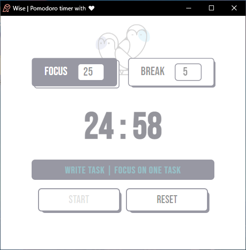

# Wise Pomodoro Timer

A Pomodoro Timer Chrome extension designed to streamline work routines and improve productivity.

## Features

- Set customizable work and break intervals.
- Stay focused on one task at a time with the single task input field.
- Store your task using LocalStorage, so it persists even if you close the browser.
- Receive notifications and visual cues to indicate when the timer ends.
- Customizable sounds to enhance your productivity experience.

## Screenshots

*User interface of Wise*

*Focus mode in Wise*

*Rest Timer*

## Installation

1. Clone the repository: `git clone https://github.com/vinod95990/Wise-Pomodoro-Timer.git`
2. Open Google Chrome and navigate to `chrome://extensions`.
3. Enable Developer Mode by toggling the switch in the top right corner.
4. Click on "Load unpacked" and select the cloned repository folder.
5. The Wise Pomodoro Timer extension should now be added to your Chrome browser.

## Usage

1. Click on the Wise Pomodoro Timer extension icon in your Chrome browser toolbar.
2. Set the desired work and break intervals.
3. Enter your task in the input field and press Enter.
4. Stay focused on your task until the timer ends.
5. Take a break and recharge before moving on to the next task.

## Credits

- Built with React, JavaScript, and CSS.
- Utilized the Web Workers API for background timer updates.
- Inspired by the Pomodoro Technique.

## License

This project is licensed under the [MIT License](LICENSE).
